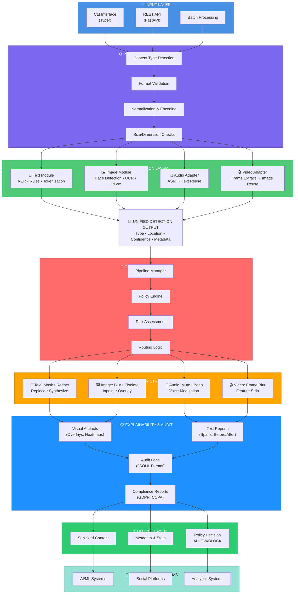

# LeakWatch Architecture Diagram

This diagram shows the complete end-to-end architecture of the LeakWatch system.

## How to Use

1. **View Online**: Copy the Mermaid code and paste it at [Mermaid Live Editor](https://mermaid.live)
2. **GitHub**: Include directly in GitHub markdown files
3. **Documentation**: Add to your documentation tools that support Mermaid (Obsidian, Notion, etc.)
4. **Export**: Use Mermaid Live Editor to export as PNG or SVG
