# LeakWatch Data Flow Pipeline Diagram

This diagram illustrates the flow of data through the LeakWatch system, from input through detection, mitigation, and audit to final sanitized output.

```mermaid
graph LR
    A["🔐 User Content<br/>Text • Image • Audio • Video"] 
    
    B["⚙️ Preprocessing<br/>Validation & Normalization"]
    
    C{"🔀 Content<br/>Type?"}
    
    T["📝 TEXT PIPELINE<br/>NER + Rules + Tokenization"]
    I["🖼️ IMAGE PIPELINE<br/>Face Detection + OCR"]
    Au["🎵 AUDIO PIPELINE<br/>ASR Conversion"]
    V["🎬 VIDEO PIPELINE<br/>Frame Extraction"]
    
    D["📊 Detection Results<br/>Entities & Regions Identified"]
    
    P["🎯 Policy Application<br/>Risk Scoring & Routing"]
    
    M["🛡️ Mitigation Applied<br/>Masking • Blur • Redaction • etc"]
    
    E["📋 Audit & Explainability<br/>Logs • Reports • Visualizations"]
    
    O["✅ Sanitized Output<br/>Content + Audit Trail"]
    
    DOWN["🚀 Safe Delivery to<br/>Downstream Systems"]
    
    A --> B
    B --> C
    
    C -->|Text| T
    C -->|Image| I
    C -->|Audio| Au
    C -->|Video| V
    
    T --> D
    I --> D
    Au --> D
    V --> D
    
    D --> P
    P --> M
    M --> E
    E --> O
    O --> DOWN
    
    style A fill:#FF6B6B,stroke:#CC5555,color:#fff
    style B fill:#7B68EE,stroke:#5A4BA8,color:#fff
    style C fill:#FFD700,stroke:#CCB000,color:#000
    style T fill:#50C878,stroke:#3A9B5C,color:#fff
    style I fill:#50C878,stroke:#3A9B5C,color:#fff
    style Au fill:#50C878,stroke:#3A9B5C,color:#fff
    style V fill:#50C878,stroke:#3A9B5C,color:#fff
    style D fill:#4A90E2,stroke:#2E5C8A,color:#fff
    style P fill:#FF6B6B,stroke:#CC5555,color:#fff
    style M fill:#FFA500,stroke:#CC8400,color:#fff
    style E fill:#1E90FF,stroke:#1566B2,color:#fff
    style O fill:#2ECC71,stroke:#229954,color:#fff
    style DOWN fill:#95E1D3,stroke:#6FA8A1,color:#000
```

## Pipeline Stages

1. **Input**: User-generated multimodal content (text, images, audio, video)
2. **Preprocessing**: Validation and normalization of input data
3. **Router**: Directs content to appropriate detection pipeline based on type
4. **Detection Pipelines**: Run in parallel for each modality
5. **Unified Results**: All detections consolidated into standard format
6. **Policy Application**: Risk scoring and mitigation strategy routing
7. **Mitigation**: Apply appropriate privacy-preserving techniques
8. **Audit & Explainability**: Generate logs, reports, and visual artifacts
9. **Output**: Sanitized content with full audit trail
10. **Downstream**: Safe transmission to AI systems or social platforms

## How to Use

1. **View Online**: Copy the Mermaid code and paste it at [Mermaid Live Editor](https://mermaid.live)
2. **GitHub**: Include directly in GitHub markdown files
3. **Documentation**: Add to your documentation tools that support Mermaid
4. **Export**: Use Mermaid Live Editor to export as PNG or SVG
